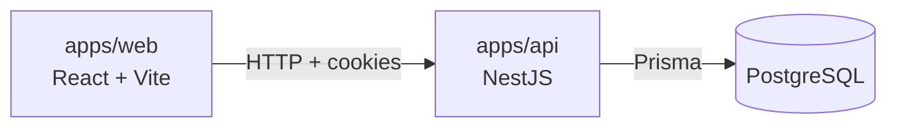

<div align="center">


# Finora

A modern full-stack personal finance platform to manage accounts, track transactions, set budgets, and analyze financial health.

[](https://github.com/agarciadk/finora/actions/workflows/ci.yml)


[](./LICENSE)

</div>

## Architecture at a glance



- **`apps/web`** — React 19 + Vite + TypeScript, Tailwind v4 with shadcn/Base UI components, i18next.
- **`apps/api`** — NestJS + TypeScript, Prisma/PostgreSQL, JWT + rotating refresh tokens in `HttpOnly` cookies.
- **Tooling** — pnpm workspaces, shared ESLint/TSConfig, Husky pre-commit checks.

See [`.ai-context/01-architecture.md`](./.ai-context/01-architecture.md) for the full architecture, [`.ai-context/02-auth-security.md`](./.ai-context/02-auth-security.md) for authentication/security details, and [`CHANGELOG.md`](./CHANGELOG.md) for the feature history.

## Quick start

Requires Node.js 20+, [pnpm](https://pnpm.io/) and [Docker](https://www.docker.com/).

```bash
pnpm install

cp .env.example .env
cp apps/api/.env.example apps/api/.env
cp apps/web/.env.example apps/web/.env
# fill in the required secrets — see each .env.example for details

pnpm db:up       # start PostgreSQL (docker compose)
pnpm db:migrate  # apply Prisma migrations
pnpm dev         # web on http://localhost:5173, api on http://localhost:3000
```

> Husky's `pre-commit` hook runs lint, unit tests and the full Playwright e2e/a11y suites, so keep PostgreSQL running and migrated before committing.

## Project structure

```
.
├── apps/
│   ├── web/        # Frontend (React + Vite) — src/, test/ (Vitest), e2e/ (Playwright)
│   └── api/         # Backend (NestJS) — src/, prisma/, test/ (Jest e2e)
├── backlog/        # Work items (FIN-XXX tasks, epics, inbox) — see backlog/README.md
└── .ai-context/    # Permanent project knowledge for AI agents and contributors
```

## Available scripts

Run from the repository root — see [`package.json`](./package.json) for the full list and each app's `package.json` for app-specific scripts:

| Script | Description |
| --- | --- |
| `pnpm dev` | Start PostgreSQL, then the frontend and backend dev servers. |
| `pnpm build` / `pnpm lint` | Build / lint every app in the workspace. |
| `pnpm test` | Run frontend unit tests (Vitest). |
| `pnpm test:e2e` / `pnpm test:a11y` | Run frontend Playwright end-to-end / accessibility tests. |
| `pnpm db:migrate` / `pnpm db:studio` | Apply Prisma migrations / browse the database. |

Both Playwright suites need the API and PostgreSQL running (`pnpm db:up && pnpm db:migrate`); install the browser once with `pnpm --filter @finora/e2e install-browsers`.

## Documentation

- [`.ai-context/`](./.ai-context/README.md) — architecture, auth/security, UI/UX conventions and gotchas.
- [`backlog/README.md`](./backlog/README.md) — how work is tracked (inbox, `FIN-XXX` tasks, epics); see also [`.github/copilot-instructions.md`](./.github/copilot-instructions.md) for the AI agent workflow.
- [`CHANGELOG.md`](./CHANGELOG.md) — history of notable changes.
- CI/CD workflows live in [`.github/workflows/`](./.github/workflows/) (lint/test/build, Playwright e2e/a11y, migrations check, deploy, release).

## Deployment

The API deploys to [Render](https://render.com/) and the database is hosted on [Neon](https://neon.tech/) (see [`render.yaml`](./render.yaml) and [`.github/workflows/deploy.yml`](./.github/workflows/deploy.yml)); the frontend deploys to [Vercel](https://vercel.com/) via its native Git integration (see [`apps/web/vercel.json`](./apps/web/vercel.json)). Full setup steps live in [`.ai-context/01-architecture.md`](./.ai-context/01-architecture.md).

## License

Apache-2.0 — see [LICENSE](./LICENSE).
